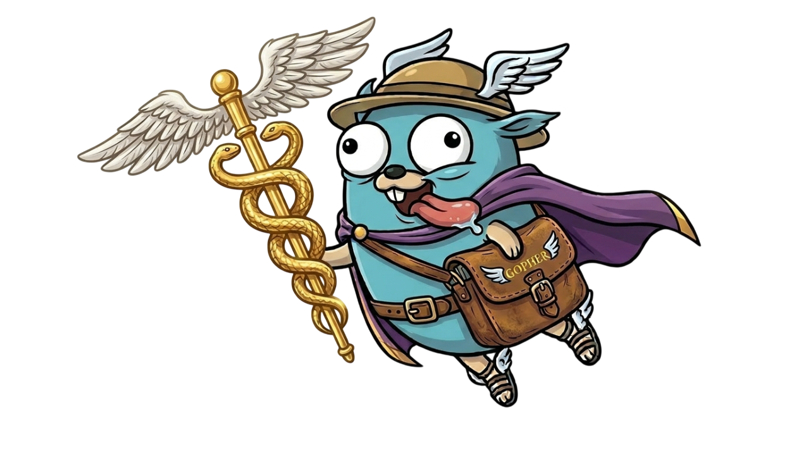

<p align="center">
    
</p>

# Hermes

Hermes is an abstraction layer that lets you write messaging logic once and run it on any platform. It treats Telegram, Discord, and Slack as pluggable transport layers, providing a unified, Gin-like API for building cross-platform communication.

## Get Started

```bash
go get github.com/gargalloeric/hermes
```

## Quick Start

```go
package main

import (
    "context"

    "github.com/gargalloeric/hermes"
    "github.com/gargalloeric/hermes/providers/telegram"
)

func main() {
    tg := telegram.NewPoller("TELEGRAM_TOKEN")

    app := hermes.New(
        hermes.WithProvider(tg),
    )

    app.OnCommand("/start", func(c *hermes.Context) {
        c.Send("Hermes is alive 🛡️!")
    })

    app.OnCommand("/ping", func(c *hermes.Context) {
        c.Send("Pong!", hermes.AsReply())
    })

    app.OnText(func(c *hermes.Context) {
        c.Send("Echo: "+c.Message.Text)
    })

    if err := app.Start(context.Background()); err != nil {
        log.Fatalf("Hermes stopped with error: %w", err)
    }
}
```

## Features

- **Multiplatform:** Write once, deploy to Telegram, Discord(soon) and more.
- **Unified Context:** Simple `c.Send()` and `c.SendTo()` methods regardless of the platform.
- **Concurrent by Design:** Every incoming message is handled in its own goroutine.
- **Logic Gates:** Combine matchers with `And()` or `Or()`. 

## Providers

| Platform | Support | Transport |
|----------|---------|-----------|
| Telegram | ✅ Active| Long Polling / Webhook (Planned) |
| Discord  | 🏗️ Planned | WebSockets |

## Advance Routing

Combine matchers to create sophisticated filters:

```go
app.On(
    hermes.And(hermes.IsImage(), hermes.Platform("telegram")),
    func (c *hermes.Context) {
        c.Send("A handler only for telegram image messages!")
    }
)
```

## Architecture

Hermes handles the "noise" of fragmented messaging APIs so you can focus on the logic.

1. **Provider:** Implements platform-specific auth, connection management, message sending and receiving, etc...
2. **Orchestrator:** Manages concurrent providers and routes messages to handlers.
3. **Context:** Encapsulates a single interaction and provides easy to use functions to interact with the platform.

## License

This project is licensed under the Apache-2.0 License.